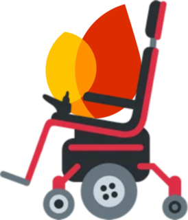

# PushCompat



PushCompat provides Firebase Cloud Messaging (FCM) to unmodified,
Play-signed apps on BenzeneOS devices without Google Play services. It handles
registration and delivery at the OS level, so apps don't need to be patched or
re-signed.

## How it works

Firebase apps normally use Google Play services for registration and message
delivery. PushCompat replaces it with a system app and a server-side bridge:

```text
GitHub -> Google -> bridge (holds the MCS connection)
                     |
                     +-> WebSocket -> PushCompat -> com.google.android.c2dm.intent.RECEIVE
                                                        |
                                                        +-> the app's Firebase SDK
```

The bridge holds the connection to Google and forwards messages to PushCompat
over a WebSocket. PushCompat sends the same broadcasts that the app's Firebase
SDK expects, so the SDK calls `onNewToken` and `onMessageReceived` normally.
PushCompat doesn't render notifications itself; the receiving app still
builds and displays them.

PushCompat sends two intents:

- `com.google.firebase.messaging.NEW_TOKEN` with `token`
- `com.google.android.c2dm.intent.RECEIVE` with `google.message_id`, `from`,
  `google.c.sender.id`, and the app's own data keys

Sending these intents requires `com.google.android.c2dm.permission.SEND`, which
third-party apps cannot obtain. BenzeneOS declares the permission and grants it
to PushCompat as a privileged system app.

## Behavior with Google Play services

PushCompat currently handles Firebase apps only when Google Play services
isn't installed.

- Without Google Play services, PushCompat registers apps and delivers push.
- With Google Play services, Google Play services continues handling FCM.

`RelayRegistry.desiredFirebasePackages()` returns an empty set whenever Play
Services is installed. App selections are still saved, but PushCompat won't act
on them. Supporting selected apps alongside Play Services needs a hook in
`ActiveServices.retrieveServiceLocked()` and a Messenger service that can
answer the Firebase SDK's `bindService` request. Neither is implemented yet.

UnifiedPush doesn't have this restriction and works whether or not Play
Services is installed.

## Components

- `PushService.kt` runs registration, the relay connection, and reconnect
  backoff.
- `RelayWebSocket.kt` implements the TLS WebSocket, resume cursor, and
  heartbeat.
- `FirebaseRegistration.kt` finds FCM apps and registers them with the bridge.
- `AppDispatcher.kt` builds and sends Firebase token and message intents.
- `UnifiedPushDistributor.kt` handles UnifiedPush registration,
  unregistration, and delivery.
- `RelayRegistry.kt` chooses active apps and updates the
  `PUSH_COMPAT_RELAY` package flags.
- `RelayStore.kt` stores the install identity, app selections, tokens, cursor,
  and delivery log.

PushCompat reads each app's Firebase configuration with
`getResourcesForApplication`. It uses `google_app_id`, `project_id`,
`google_api_key`, and `gcm_defaultSenderId`, along with the signing certificate
from `GET_SIGNING_CERTIFICATES`. This avoids maintaining a separate app catalog.

When resolving the target receiver, PushCompat prefers a name ending in
`FirebaseInstanceIdReceiver`. It then tries a receiver whose name doesn't
contain `analytics` or `measurement`, and finally falls back to the first match.
Sending the intent to an analytics receiver fails silently, which is why the
order matters.

## Framework dependencies

PushCompat depends on two framework changes outside this repository.

### C2DM permissions

`com.google.android.c2dm.permission.SEND` must be declared by a preinstalled
package, with `com.google.android.c2dm.permission.RECEIVE` declared at `normal`.
FCM apps request `RECEIVE` during installation. Android won't grant it later if
the package declaring the permission is installed after them.

### Notification channels

Many apps create their notification channels after `getToken()` completes.
Without Play Services, that task never completes and the channels aren't
created. The message still arrives and decrypts, but
`NotificationManagerService` drops it with `No Channel found`.

The framework creates a default channel for packages with
`GosPackageStateFlag.PUSH_COMPAT_RELAY`. This limits the behavior to apps
enabled in PushCompat.

`CHANGE_DEVICE_IDLE_TEMP_WHITELIST` is also required, and is privileged.
`AppDispatcher` calls `BroadcastOptions.setTemporaryAppAllowlist` so the target
app can start a service while the device is idle. Without the permission, every
delivery throws `SecurityException`. The permission is allowlisted in
`etc/permissions/privapp-permissions-com.benzeneos.pushcompat.xml`; on a build with
`ro.control_privapp_permissions=enforce`, platform signing alone isn't enough.

## Status

Firebase delivery has been tested end to end on a Pixel 7 Pro with Google Play
services and the old patched-app transport disabled. A GitHub mention arrived
through the bridge and rendered on GitHub's `direct_mentions` channel in about
200 ms.

The automatic notification channel path hasn't been tested because the test
app already had its channels. Running PushCompat for selected Firebase apps
while Google Play services is installed also isn't implemented yet.

## Icons

The launcher uses `mipmap-anydpi-v26/ic_launcher.xml` with
`ic_launcher_foreground` and `@color/pushcompat_icon_background`. Pre-API 26
devices use the square `ic_launcher.png`. `ic_pushcompat.xml` is both the
notification icon and the monochrome launcher layer. Android masks small
notification icons to a silhouette, so the full-color launcher artwork cannot
be used there.
